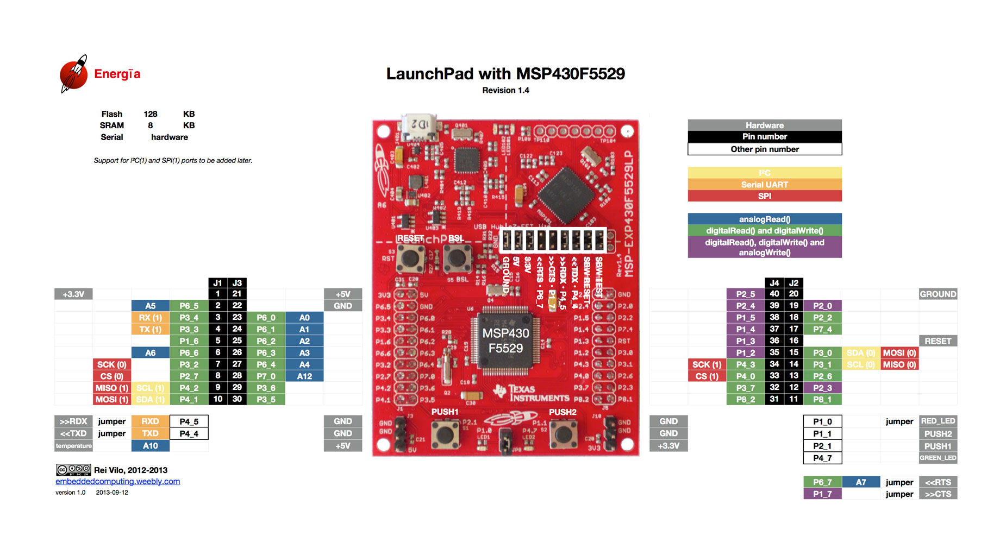
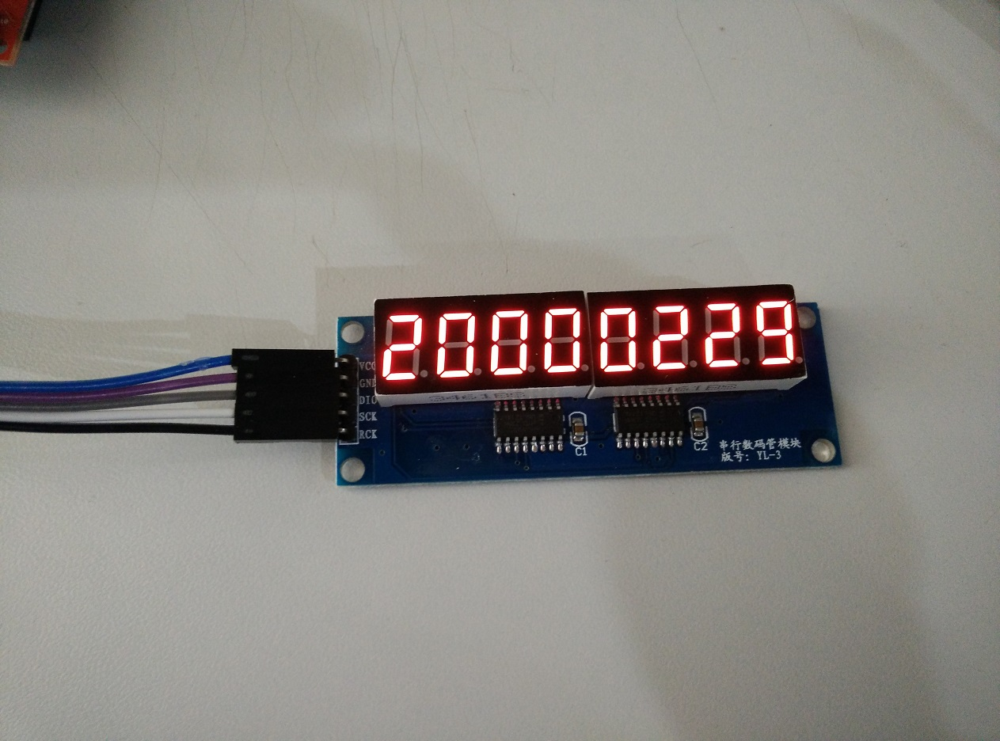
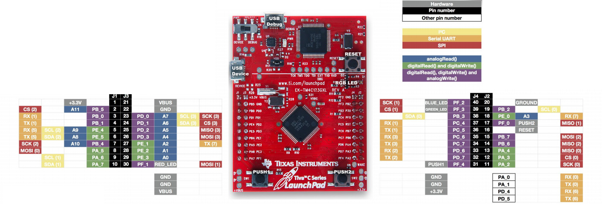
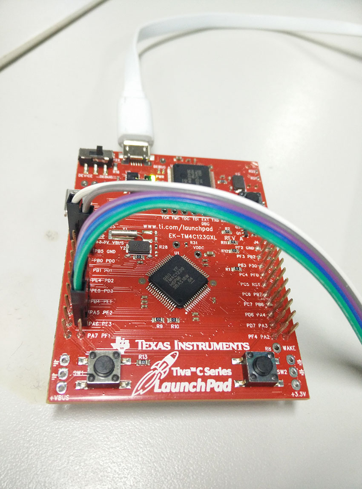

# msp430-ymd

##MSP430F5529引脚图

    我们使用了其中的三个引脚输出,两个引脚输入,还有板载的两个LED(P1.0和P4.7)
    三个输出分别是P2.7,P4.2,P4.1,分别接数码管的DIO,SCK,RCK
    两个输入则是板载的两个按钮,P2.1和P1.1

    如图所示,它支持闰年判断,在2000年2月会有29天
    下图则是今天的日期

    这里我们同时也支持了TM4C123的Launchpad
    接线方法为:PE_1,PE_2,PE_3分别接数码管的DIO,SCK,RCK
    按钮也改为了PUSH1,PUSH2

